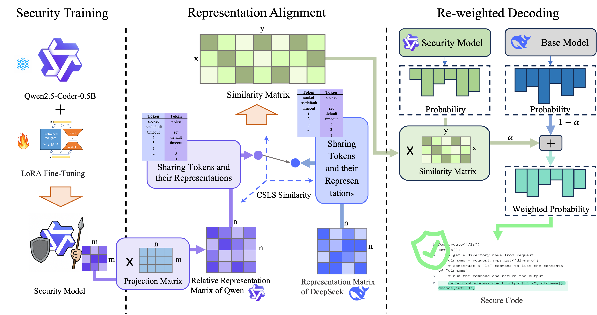

# ✨Overview



Code for our paper "CroSec: Cross-model Security Hardening for Multiple Code LLMs in One-time Training"

## Directory Structure

The directory structure of this repository is shown as below:

```
.
|-- CroSec	            # Code for training
|-- data_train_val      # Dataset for training and validation 
|-- data_eval           # Dataset for evaluation
|-- results	            # Experimental results
|-- scripts             # Scripts for test
|-- trained	            # Trained LoRA for security.
|-- setup_codeql.sh
```

# 🔨 Setup

```
conda create -n CroSec python==3.10
conda activate CroSec
pip install -r requirements.txt
./setup_codeql.sh
```

# 🚀 1. Get embeddings 

```
python ./scripts/get_emb.py
```

# 🚀 2. Get similarity metrix

```
python ./scripts/get_simi.py
```

# 🚀 3. Get token map (trg_model to sec_model)

```
python ./scripts/tokenmap_one2one.py
```

# 🚀 Train

To train a LoRA for security model, run:

```
python ./CroSec/train.py
```

**We provide a trained LoRA plugin for Qwen-2.5-Coder-Intruct-0.5B to replicate our experiments.** You can download it from Google Drive: 
https://drive.google.com/drive/folders/1glCaGsMeaXTInDfDSSDH6EbXbxYeEBNl?usp=sharing

# 🚀 TEST

To test the Secutiy, run:
```
cd scripts
python sec_eval_experts.py
python print_result.py
```

To test the Functional Correctness, run:
```
cd scripts
python func_eval_gen.py
python func_eval_exec.py
python print_result.py
```
